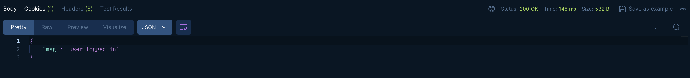
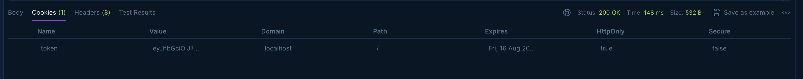
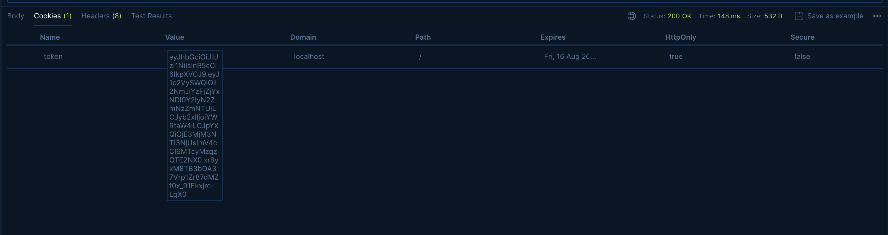

# Hunting Buddy - Job Application Tracker App


<sub>image source: [Pixabay](https://pixabay.com/illustrations/application-pen-write-writing-tool-1915343/)</sub>


<sub>image source: [Unblast](https://unblast.com/)</sub>

<!-- 

<sub>image source: [Pixabay](https://pixabay.com/photos/trousers-pocket-note-wrench-job-1255851/)</sub> -->

## Overview

1. [Description](#description)
2. [Deployment Link](#deployment-link)
3. [Installation](#installation)
4. [Technologies Used](#technologies)
5. [Deliverables](#deliverables)
6. [Planning & Build Process](#planning)
7. [Challenges](#challenges)
8. [Wins](#wins)
9. [Key Learnings & Takeaways](#takeaways)
10. [Future Improvements](#future-improvements)

---

## <a name="description"></a> 1. Description

<!--


image source: []()

Job application tracker to help you keep an overview during your job hunt.

MERN -> react frontend, backend based in express, mongoDB and node.js

- full crud functionality
- authentication
- responsive design, styled components

 -->

## <a name="deployment-link"></a> 2. Deployment Link

## <a name="installation"></a> 3. Installation

#### Package Manager: npm (v10.8.1)

- <sub>[website](https://www.npmjs.com/)</sub>
- <sub>[GitHub Repository](https://github.com/npm)</sub>

#### Getting Started

- Ensure [Git](https://git-scm.com/) is installed on your machine.
- Clone the repository by running this command in your terminal:

```zsh
git clone https://github.com/katieloesch/hunting-buddy.git
```

- Navigate to the project directory to install dependencies:

```zsh
cd hunting-buddy
```

### Running the Application Locally in a local development environment:

**1. Install Dependencies**

- Run the following command in the project’s root directory to install all necessary dependencies on both the frontend and the backend:

```zsh
npm run setup-project
```

**2. Start Development Servers**

- After installing the dependencies, start the the backend and frontend servers (concurrently) run:

```zsh
npm run dev
```

**3. Access the Application**

- The backend development server will start at `http://localhost:5100/`.
- The frontend development server will start at `http://localhost:5173/`.
- By default, your web browser should automatically open and navigate to this address.
- If it doesn’t, you can manually access the application by entering `http://localhost:5173/` in any web browser.

## <a name="technologies"></a> 4. Technologies Used

### Core Technologies

### Key Dependencies - Frontend

- **Sass** (v1.77.8)
  - <sub>CSS preprocessor used for styling the application</sub>
  - <sub>[npm page](https://www.npmjs.com/package/sass)</sub>
  - <sub>[GitHub repository](https://github.com/sass/dart-sass)</sub>
- **@tanstack/react-query** (v4.29.5)
  - <sub>A library for managing server-side data in React applications, providing features like caching, synchronization, and automatic background updates for fetching and updating data.</sub>
  - <sub>[npm page](https://www.npmjs.com/package/@tanstack/react-query)</sub>
  - <sub>[GitHub repository](https://github.com/TanStack/query)</sub>
  - <sub>[website](https://tanstack.com/query/latest)</sub>
- **@tanstack/react-query-devtools** (v4.29.6)
  - <sub>A development tool that works alongside react-query, offering a visual interface for inspecting and debugging your data fetching operations in a React application.</sub>
  - <sub>[npm page](https://www.npmjs.com/package/@tanstack/react-query-devtools)</sub>
  - <sub>[GitHub repository](https://github.com/TanStack/query)</sub>
  - <sub>[website](https://tanstack.com/query/latest)</sub>
- **axios** (v1.3.6)
  - <sub>A promise-based HTTP client for Node.js and the browser that simplifies making asynchronous HTTP requests to REST endpoints.</sub>
  - <sub>[npm page](https://www.npmjs.com/package/axios)</sub>
  - <sub>[GitHub repository](https://github.com/axios/axios)</sub>
  - <sub> [website](https://axios-http.com/)</sub>
- **dayjs** (v1.11.7)
  - <sub>A minimalist JavaScript library for parsing, validating, manipulating, and formatting dates, offering a lightweight and fast alternative to Moment.js.</sub>
  - <sub>[npm page](https://www.npmjs.com/package/dayjs)</sub>
  - <sub>[GitHub repository](https://github.com/iamkun/dayjs)</sub>
  - <sub> [website](https://day.js.org/)</sub>
- **react-icons** (v4.8.0)
  - <sub>a free and open-source project providing icons for use in React projects</sub>
  - <sub>[npm page](https://www.npmjs.com/package/react-icons)</sub>
  - <sub>[GitHub repository](https://github.com/react-icons/react-icons)</sub>
  - <sub> [website](https://react-icons.github.io/react-icons/)</sub>
- **react-router-dom** (v6.10.0)
  - <sub>An implementation of react-router that includes additional components for browser-based routing</sub>
  - <sub>[npm page](https://www.npmjs.com/package/react-router-dom)</sub>
  - <sub>[GitHub repository](https://github.com/remix-run/react-router)</sub>
  - <sub> [website](https://reactrouter.com/en/main)</sub>
- **react-toastify** (v9.1.2)
  - <sub>A library for displaying customizable toast notifications in React applications, making it easy to show alerts, success messages, and other notifications.</sub>
  - <sub>[npm page](https://www.npmjs.com/package/react-toastify)</sub>
  - <sub>[GitHub repository](https://github.com/fkhadra/react-toastify)</sub>
  - <sub> [website](https://fkhadra.github.io/react-toastify/introduction/)</sub>
- **recharts** (v2.5.0)
  - <sub>A charting library built with React components, enabling developers to create a wide variety of customizable charts and visualizations with ease.</sub>
  - <sub>[npm page](https://www.npmjs.com/package/recharts)</sub>
  - <sub>[GitHub repository](https://github.com/recharts/recharts)</sub>
  - <sub> [website](https://recharts.org/en-US/)</sub>
- **styled-components** (v5.3.10)
  - <sub>A library for styling React applications using tagged template literals, allowing developers to write CSS directly within JavaScript and create component-scoped styles.</sub>
  - <sub>[npm page](https://www.npmjs.com/package/styled-components)</sub>
  - <sub>[GitHub repository](https://github.com/styled-components/styled-components)</sub>
  - <sub> [website](https://styled-components.com/)</sub>

### Key Dependencies - Backend

-

<!--

    "bcryptjs": "^2.4.3",
    "cloudinary": "^1.37.3",
    "concurrently": "^8.0.1",
    "cookie-parser": "^1.4.6",
    "datauri": "^4.1.0",
    "dayjs": "^1.11.9",
    "dotenv": "^16.0.3",
    "express": "^4.18.2",
    "express-async-errors": "^3.1.1",
    "express-mongo-sanitize": "^2.2.0",
    "express-rate-limit": "^6.8.0",
    "express-validator": "^7.0.1",
    "helmet": "^7.0.0",
    "http-status-codes": "^2.2.0",
    "jsonwebtoken": "^9.0.0",
    "mongoose": "^7.0.5",
    "morgan": "^1.10.0",
    "multer": "^1.4.5-lts.1",
    "nanoid": "^4.0.2",
    "nodemon": "^2.0.22"

 -->

### UI and Design

- **Icons**

  - **React Icons**
    - <sub>A free and open-source project providing icons for use in React projects.</sub>
    - <sub> [website](https://react-icons.github.io/react-icons/)</sub>
    - <sub>[GitHub repository](https://github.com/react-icons/react-icons)</sub>
    - <sub>[license](https://github.com/react-icons/react-icons/blob/master/LICENSE)</sub>

- **Images**
  - **Pixabay**
    - <sub>A free stock photo and media platform offering a vast library of images, videos and music.</sub>
    - <sub>[website](https://pixabay.com/)</sub>
    - <sub>[license](https://pixabay.com/service/license-summary/)</sub>
  - **istockphoto**
    - <sub>A stock content service offering a wide range of photos, illustrations, videos, and audio clips for creative projects.</sub>
    - <sub>[website](https://www.istockphoto.com/)</sub>
    - <sub>[license](https://www.istockphoto.com/legal/license-agreement)</sub>
  - **Unblast**
    - <sub>A platform that offers a collection of design resources, including templates, mockups, icons and other creative assets for designers and developers.</sub>
    - [website](https://unblast.com/)
    - [license](https://unblast.com/license/)

### Development Tools

### Resources & Tutorials

- **Documentation**
  - <sub>[vite](https://vitejs.dev/guide/)</sub>
  - <sub>[react-router: Migrating to RouterProvider](https://reactrouter.com/en/main/upgrading/v6-data)</sub>
  - <sub>[TanStack Query](https://tanstack.com/query/latest/docs/framework/react/quick-start)</sub>
  - <sub>[axios](https://axios-http.com/docs/intro)</sub>
  - <sub>[dayjs](https://day.js.org/docs/en/installation/installation)</sub>
  - <sub>[styled-components](https://styled-components.com/docs)</sub>
- **Blogs**
  - <sub>[The Power Of CreateBrowserRouter: Optimizing Your React App's Navigation](https://www.dhiwise.com/post/the-power-of-createbrowserrouter-optimizing-your-react-app) by Daxesh Patel</sub>
  - <sub>[Getting Started with createBrowserRouter in react-router-dom](https://medium.com/@pavitramodi.it/getting-started-with-createbrowserrouter-in-react-router-dom-e3131820fef4) by [Pavitra Modi](https://medium.com/@pavitramodi.it)</sub>
- **YouTube**
  - <sub>[React Router in Depth #3 - Router Provider, createBrowserRouter & Outlet](https://www.youtube.com/watch?v=5s57C7leXc4&pp=ygUacmVhY3QgY3JlYXRlYnJvd3NlcnJvdXRlciA%3D) by [Net Ninja](https://www.youtube.com/@NetNinja)</sub>
  - <sub>[Javascript Nuggets - FormData API](https://youtu.be/5-x4OUM-SP8) by [Coding Addict](https://www.youtube.com/@CodingAddict)</sub>
  - <sub>[FormData API - React](https://youtu.be/WrX5RndZIzw) by [Coding Addict](https://www.youtube.com/@CodingAddict)</sub>
- **Udemy**
  - <sub>[MERN 2024 Edition - MongoDB, Express, React and NodeJS](https://www.udemy.com/course/mern-stack-course-mongodb-express-react-and-nodejs/) by [John Smilga](https://www.udemy.com/user/janis-smilga-3/)</sub>
  - <sub>[The Complete Node.js Developer Course (3rd Edition)](https://www.udemy.com/course/the-complete-nodejs-developer-course-2/) by [Andrew Mead](https://www.udemy.com/user/andrewmead/) & [Rob Percival](https://www.udemy.com/user/robpercival/)</sub>
  - <sub>[React, NodeJS, Express & MongoDB - The MERN Fullstack Guide]() by [Manuel Lorenz](https://www.udemy.com/user/manuel-lorenz/) & [Maximilian Schwarzmüller](https://www.udemy.com/user/maximilian-schwarzmuller/)</sub>
  - <sub>[React - The Complete Guide 2024 (incl. Next.js, Redux)](https://www.udemy.com/course/react-the-complete-guide-incl-redux/learn/lecture/25595350?start=0#overview) by [Maximilian Schwarzmüller](https://www.udemy.com/user/maximilian-schwarzmuller/)</sub>

## <a name="deliverables"></a> 5. Deliverables

<!-- ### MVP

### Potential Extra Features / Stretch Goals

### User Stories -->

## <a name="planning"></a> 6. Planning & Build Process

<!-- bronze plan | silver plan | gold plan

 -->

## <a name="challenges"></a> 7. Challenges

## <a name="wins"></a> 8. Wins

## <a name="takeaways"></a> 9. Key Learnings & Takeaways

## <a name="future-improvements"></a> 10. Future Improvements

<!--

--------------------------------------------------------------------------------------


*** Notes ***

### day 1:23/07/2024

- set up frontend using vite

```zsh

npm create vite@latest application-tracker-client -- --template react

```

import some global syles (css) from a template

day 2: 24/07/2024

- install npm packages
- set up react router
- create react components for different pages
- set up nested routes

day 2: 25/07/2024

27/07/2024

- set up content for 404 page
- moved logo into its own react component so I can reuse it in other places

---

challenges:

wins:
This was not my first React project, so for this app I wanted to challenge myself and expand my understanding of the framework. I set up previous application using the 'create-react-app' command so for this project I wanted to learn how to use vite. Although the file structure and jsx extension are slighly different it didn't take me too long to get the hang of it.

Similarly, I have used react router before, but I normally do so using the the `<BrowserRouter>`, `<Route>` and `<Routes>` components. For this project I wanted to learn how to set up the routes using the newer `createBrowserRouter()` function and the `<RouterProvider>` components released with react version??. Those took a bit longer to get working as the syntax for setting up nested routes looks different than it does using the more familar `<Route>` and `<Routes>` but I think it's a great addition to react-router-dom package. Although this might be subjective, I find setting up the routes as an array of objects looks cleaner and it's easier to get an overview over the routes in a project. I will definitely make use of these newer components in future projects.


```JSX
import React from 'react';
import { createBrowserRouter, RouterProvider } from 'react-router-dom';

import {
  AddJob, Admin, AllJobs, DashboardLayout, Error, HomeLayout, Landing, Login, Profile, Register, Stats
} from './pages';

const router = createBrowserRouter([
  {
    path: '/',
    element: <HomeLayout />,
    errorElement: <Error />,
    children: [
      {
        index: true,
        element: <Landing />,
      },
      {
        path: 'register',
        element: <Register />,
      },
      {
        path: 'login',
        element: <Login />,
      },
      {
        path: 'dashboard',
        element: <DashboardLayout />,
        children: [
          {
            index: true,
            element: <AddJob />,
          },
          {
            path: 'stats',
            element: <Stats />,
          },
          {
            path: 'all-jobs',
            element: <AllJobs />,
          },
          {
            path: 'profile',
            element: <Profile />,
          },
          {
            path: 'admin',
            element: <Admin />,
          },
        ],
      },
    ],
  },
]);

```

This was also the first time I used styled-components. Although the syntax is slightly different, it is pretty similar to the css/scss I'm used to and I managed to give  the app a fully responsive design.

```JSX

const router = createBrowserRouter([
  {
    path: '/',
    element: <HomeLayout />,
    errorElement: <Error />,
    children: [
      {
        index: true,
        element: <Landing />,
      },
      {
        path: 'register',
        element: <Register />,
      },
      {
        path: 'login',
        element: <Login />,
      },
      {
        path: 'dashboard',
        element: <DashboardLayout />,
      },
    ],
  },
]);

const App = () => {
  return <RouterProvider router={router} />;
};

```

In React Router, `<Route>` and `<Routes>` are components traditionally used for defining routes within a single-page application (SPA). On the other hand, `createBrowserRouter` and `RouterProvider` are newer APIs introduced in React Router v6.4 to provide a more flexible and powerful routing system.

### `<Route>` and `<Routes>`

- **Purpose**: These components are used to define and manage the routing within your React application.
- **Usage**:
  - `<Routes>` is a container for all your route definitions.
  - `<Route>` defines individual routes and their corresponding components.

#### Example:

```jsx
import { BrowserRouter, Routes, Route } from 'react-router-dom';

function App() {
  return (
    <BrowserRouter>
      <Routes>
        <Route path='/' element={<Home />} />
        <Route path='/about' element={<About />} />
        <Route path='/contact' element={<Contact />} />
      </Routes>
    </BrowserRouter>
  );
}
```

### `createBrowserRouter` and `RouterProvider`

- **Purpose**: These APIs provide a more declarative way to configure routing, supporting data loading, error handling, and nested routing structures out of the box.
- **Usage**:
  - `createBrowserRouter` is used to create a router instance with a more structured and centralized configuration.
  - `RouterProvider` is used to provide the router instance to your application, similar to how you might use a context provider.

#### Example:

```jsx
import { createBrowserRouter, RouterProvider } from 'react-router-dom';

const router = createBrowserRouter([
  {
    path: '/',
    element: <Home />,
    children: [
      {
        path: 'about',
        element: <About />,
      },
      {
        path: 'contact',
        element: <Contact />,
      },
    ],
  },
]);

function App() {
  return <RouterProvider router={router} />;
}
```

- https://reactrouter.com/en/main/upgrading/v6-data
- https://www.dhiwise.com/post/the-power-of-createbrowserrouter-optimizing-your-react-app
- https://medium.com/@pavitramodi.it/getting-started-with-createbrowserrouter-in-react-router-dom-e3131820fef4

### Key Differences

1. **Configuration Style**:

   - **Route and Routes**: These components are JSX-based and are typically used within the render method of your component.
   - **createBrowserRouter and RouterProvider**: These are more configuration-based, allowing you to define routes in a more structured manner, supporting nested routes and other advanced features directly.

2. **Features**:

   - **Route and Routes**: Basic routing capabilities.
   - **createBrowserRouter and RouterProvider**: Enhanced features such as data loading, deferred rendering, error handling, and nested routing directly within the route configuration.

3. **API Flexibility**:

   - **Route and Routes**: More straightforward and traditional approach, suitable for simpler applications.
   - **createBrowserRouter and RouterProvider**: Provides a more powerful and flexible API, ideal for complex applications requiring advanced routing capabilities.

4. **Centralized Configuration**:
   - **Route and Routes**: Routes are defined directly within the component tree.
   - **createBrowserRouter and RouterProvider**: Routes are configured in a centralized object, making it easier to manage and understand the routing structure of the application.

### Summary

- Use **`<Route>` and `<Routes>`** for straightforward and traditional JSX-based route definitions within your components.
- Use **`createBrowserRouter` and `RouterProvider`** for a more powerful, declarative, and centralized routing configuration that supports advanced features like nested routes, data loading, and error handling.

Vite and Create React App (CRA) are both tools used to set up and manage React projects, but they have several differences in terms of performance, features, and use cases. Here's a detailed comparison between the two:

### 1. **Performance**

- **Vite**:
  - **Faster Development Builds**: Vite leverages native ES module imports in the browser, enabling it to start the development server almost instantly regardless of the size of the application.
  - **Hot Module Replacement (HMR)**: Vite provides faster HMR, making updates almost instantaneous by only replacing the changed modules without a full page reload.
- **Create React App**:
  - **Slower Development Builds**: CRA uses Webpack, which can be slower, especially for larger projects. Initial startup and subsequent rebuilds can take longer.
  - **Hot Module Replacement (HMR)**: CRA supports HMR, but it can be slower compared to Vite due to the underlying Webpack build process.

### 2. **Bundling**

- **Vite**:

  - Uses Rollup for production builds, which is known for its efficient tree-shaking and smaller bundle sizes.
  - Supports code splitting out of the box.

- **Create React App**:
  - Uses Webpack for both development and production builds. Webpack is highly configurable but can result in larger build times and potentially larger bundle sizes.
  - Also supports code splitting through dynamic `import()` calls, but configuration might be less straightforward compared to Vite.

### 3. **Configuration and Extensibility**

- **Vite**:
  - Designed to be minimal out of the box but highly extensible through plugins.
  - Simpler configuration through a single `vite.config.js` file.
- **Create React App**:
  - Convention over configuration: CRA is designed to work with zero configuration out of the box.
  - Extending CRA requires ejecting, which exposes the underlying Webpack configuration but makes future updates harder.

### 4. **Community and Ecosystem**

- **Vite**:

  - Developed and maintained by the creator of Vue.js, Evan You, and has a growing community.
  - Gaining popularity rapidly due to its performance advantages and modern approach.

- **Create React App**:
  - Created by Facebook and has a large, established community.
  - A lot of resources, tutorials, and third-party tools are available due to its long-standing presence in the React ecosystem.

### 5. **Features**

- **Vite**:

  - Support for multiple frameworks: While CRA is specific to React, Vite can be used with Vue, Svelte, and other frameworks.
  - Modern JavaScript and TypeScript support out of the box.

- **Create React App**:
  - Focused on React projects with robust support for JSX and React-specific features.
  - Supports modern JavaScript and TypeScript with minimal configuration.

### 6. **Build Output and Optimization**

- **Vite**:

  - Produces highly optimized builds with smaller bundle sizes thanks to Rollup.
  - Efficient tree-shaking and dead code elimination.

- **Create React App**:
  - Produces optimized builds with Webpack, but they can be larger compared to Vite's output.
  - Good support for code splitting and lazy loading.

### Conclusion

**Vite** is a modern build tool that offers faster development builds, better HMR, and smaller production builds, making it an excellent choice for new projects or developers looking for a highly performant setup. **Create React App** is a well-established, easy-to-use tool that provides a solid foundation for React projects with minimal configuration, making it suitable for beginners and projects where community support and stability are paramount.

Choosing between the two depends on your specific needs:

- Use **Vite** if you prioritize fast development times, modern build optimizations, and flexibility with configuration.
- Use **Create React App** if you prefer convention over configuration, need extensive community support, or are starting with React and want a stable, familiar tool.

lessons learned:


day: 31/07/2024
-> logout button
-> dark theme
-> save dark theme to localStorage


App.jsx

```JSX

export const getThemeFromLS = () => {
  const darkThemeActiveLS = localStorage.getItem('darkThemeActive') === 'true';
  document.body.classList.toggle('dark-theme', darkThemeActiveLS);
  return darkThemeActiveLS;
};

getThemeFromLS();

```

DashboardLayout.jsx

```JSX
  import { getThemeFromLS } from '../App';

  const [darkThemeActive, setDarkThemeActive] = useState(getThemeFromLS());

  const toggleDarkTheme = () => {
    const updatedTheme = !darkThemeActive;
    setDarkThemeActive(updatedTheme);
    document.body.classList.toggle('dark-theme', updatedTheme);
    localStorage.setItem('darkThemeActive', updatedTheme);
  };
```

index.css
```CSS
  .dark-theme {
    --text-color: var(--dark-mode-text-color);
    --background-color: var(--dark-mode-bg-color);
    --text-secondary-color: var(--dark-mode-text-secondary-color);
    --background-secondary-color: var(--dark-mode-bg-secondary-color);
  }
```

wins:
I wanted to implement a dark/light theme as well as had never been able to implement this in previous applications I build due to time constraints, so it was important to me to set some time aside during this project to achieve this.
I also thought it would be nice if the theme stayed the same after reloading the page, so I decided to save the theme to active storage once the toggle button is clicked and then automatically apply it again once the page reloads.

```JSX

import React from 'react';
import { BsFillSunFill, BsFillMoonFill } from 'react-icons/bs';
import Wrapper from '../styledComponents/ThemeToggle';
import { useDashboardContext } from '../pages/DashboardLayout';

const ThemeToggle = () => {
  const { darkThemeActive, toggleDarkTheme } = useDashboardContext();

  return (
    <Wrapper onClick={toggleDarkTheme}>
      {darkThemeActive ? (
        <BsFillSunFill className='toggle-icon' />
      ) : (
        <BsFillMoonFill className='toggle-icon' />
      )}
    </Wrapper>
  );
};

export default ThemeToggle;

```


31/07/2024

start backend
set up separate json file for backend:

```zsh
npm init -y
```

add server.js file to backend

package.json:
add
  "type": "module",

set up .gitignore

install packages
- bcryptjs@2.4.3
- concurrently@8.0.1
- cookie-parser@1.4.6
- dayjs@1.11.7
- dotenv@16.0.3
- express@4.18.2
- express-async-errors@3.1.1
- express-validator@7.0.1
- http-status-codes@2.2.0
- jsonwebtoken@9.0.0
- mongoose@7.0.5
- morgan@1.10.0
- multer@1.4.5-lts.1
- nanoid@4.0.2
- nodemon@2.0.22
- cloudinary@1.37.3
- dayjs@1.11.9
- datauri@4.1.0
- helmet@7.0.0
- express-rate-limit@6.8.0
- express-mongo-sanitize@2.2.0


set up script in package.json that installs all dependencies:

```zsh
"scripts": {
    "setup-project": "npm i && cd client && npm i",
    "dev": "nodemon server.js"
  },
```


- set up express server

```

import express from 'express';

const app = express();

app.get('/', (req, res) => {
  res.send('hello world');
});

app.listen(5100, () => {
  console.log('server running on port 51000...');
});


```


test it:

npm run dev


14/08/2024
```
import jwt from 'jsonwebtoken';

export const createJWT = (payload) => {
  const token = jwt.sign(payload, process.env.JWT_SECRET, {
    expiresIn: process.env.JWT_EXPIRES_IN,
  });
  return token;
};

```


```
export const login = async (req, res) => {
  const user = await User.findOne({ email: req.body.email });

  // 1) check if user with input email exists in db
  // 2) if user exists, check if password is correct

  const isValidUser =
    user && (await comparePasswords(req.body.password, user.password));

  if (!isValidUser) {
    // if user doesn't exist in db or passwords don't match -> 401
    throw new UnauthenticatedError('invalid credentials');
  }

  const token = createJWT({
    userId: user._id,
    role: user.role,
  });

  //one day in milliseconds
  const oneDayMs = 1000 * 60 * 60 * 24;

  // name: token,
  res.cookie('token', token, {
    httpOnly: true,
    expires: new Date(Date.now() + oneDayMs),
    secure: process.env.NODE_ENV,
  });

  res.status(StatusCodes.OK).json({ msg: 'user logged in' });
};

```


This function `login` is an asynchronous function used in a Node.js/Express application to handle user authentication. Let's break down the code step by step:

### 1. Finding the User in the Database
```javascript
const user = await User.findOne({ email: req.body.email });
```
- **Purpose**: This line attempts to find a user in the database using the email provided in the request body (`req.body.email`).
- **Outcome**: If a user with that email exists, the `user` variable will contain the user's data. If not, `user` will be `null`.

### 2. Validating the User and Password
```javascript
const isValidUser = user && (await comparePasswords(req.body.password, user.password));
```
- **Purpose**: This line checks two conditions:
  - Whether the `user` exists (i.e., the user was found in the database).
  - Whether the provided password matches the stored hashed password in the database.
- **Outcome**:
  - `isValidUser` will be `true` if both the user exists and the password is correct.
  - If either the user doesn't exist or the password is incorrect, `isValidUser` will be `false`.

### 3. Handling Invalid Credentials
```javascript
if (!isValidUser) {
  throw new UnauthenticatedError('invalid credentials');
}
```
- **Purpose**: This block checks if the user credentials are invalid.
- **Outcome**:
  - If `isValidUser` is `false`, an `UnauthenticatedError` is thrown, which will typically result in an HTTP 401 Unauthorized response being sent back to the client.
  - The error message is "invalid credentials."

### 4. Creating a JWT (JSON Web Token)
```javascript
const token = createJWT({
  userId: user._id,
  role: user.role,
});
```
- **Purpose**: This line creates a JWT using the `createJWT` function. The payload of the token includes the user's ID and role.
- **Outcome**:
  - A JWT token is generated, which will be used to authenticate subsequent requests made by the user.

### 5. Setting the JWT in a Cookie
```javascript
res.cookie('token', token, {
  httpOnly: true,
  expires: new Date(Date.now() + oneDayMs),
  secure: process.env.NODE_ENV,
});
```
- **Purpose**: This block sets the JWT as a cookie in the response to the client.
- **Cookie Options**:
  - `httpOnly: true`: Ensures that the cookie is only accessible via HTTP(S) and not client-side JavaScript, enhancing security.
  - `expires`: Sets the cookie's expiration time to one day from the current time.
  - `secure`: Ensures the cookie is sent only over HTTPS if the `NODE_ENV` environment variable is set (usually to `production`).

### 6. Sending the Success Response
```javascript
res.status(StatusCodes.OK).json({ msg: 'user logged in' });
```
- **Purpose**: This line sends an HTTP 200 OK response back to the client, indicating that the user has successfully logged in.
- **Outcome**: The response contains a JSON object with a success message.

### The `createJWT` Function
```javascript
export const createJWT = (payload) => {
  const token = jwt.sign(payload, process.env.JWT_SECRET, {
    expiresIn: process.env.JWT_EXPIRES_IN,
  });
  return token;
};
```
- **Purpose**: This function is responsible for creating a JWT.
- **Parameters**:
  - `payload`: Contains data that will be embedded in the JWT, such as the user ID and role.
  - `process.env.JWT_SECRET`: A secret key used to sign the JWT. This should be stored securely in environment variables.
  - `process.env.JWT_EXPIRES_IN`: Defines how long the token will be valid.
- **Outcome**: The function returns the generated JWT.

### Summary
- **Functionality**: The `login` function authenticates a user by checking the email and password, generates a JWT if the credentials are valid, and then sets this JWT in a cookie before sending a response back to the client.
- **Error Handling**: If the email or password is incorrect, the function throws an `UnauthenticatedError`, which should be handled by the Express error middleware to return a 401 status code to the client.


15/08/2024

```JavaScript
export const login = async (req, res) => {
  const user = await User.findOne({ email: req.body.email });

  // 1) check if user with input email exists in db
  // 2) if user exists, check if password is correct

  const isValidUser =
    user && (await comparePasswords(req.body.password, user.password));

  if (!isValidUser) {
    // if user doesn't exist in db or passwords don't match -> 401
    throw new UnauthenticatedError('invalid credentials');
  }

  const token = createJWT({
    userId: user._id,
    role: user.role,
  });

  //one day in milliseconds
  const oneDayMs = 1000 * 60 * 60 * 24;

  // send back cookie, name of cookie: 'token',
  res.cookie('token', token, {
    httpOnly: true, // can't be accessed using JS, makes it more secure
    expires: new Date(Date.now() + oneDayMs), // jwt expires in 1 day, set cookie expiration to same value but in ms
    secure: process.env.NODE_ENV === 'production', // true if while in production env (https), false while in dev env (http)
  });

  res.status(StatusCodes.OK).json({ msg: 'user logged in' });
};


```






```JavaScript
import { UnauthenticatedError } from '../errors/customErrors.js';
import { verifyJWT } from '../utils/tokenUtils.js';

export const authenticateUser = (req, res, next) => {
  const { token } = req.cookies;
  if (!token) {
    throw new UnauthenticatedError('authentication invalid'); // 401
  }

  try {
    const { userId, role } = verifyJWT(token);
    req.user = { userId, role };

    next();
  } catch (error) {
    throw new UnauthenticatedError('authentication invalid'); // 401
  }
};

```
Token Extraction:
The authenticateUser middleware first extracts the token from the cookies using req.cookies.

Token Verification:
The token is then verified using the verifyJWT function, which is assumed to decode the JWT (JSON Web Token) and return the payload. The payload typically includes the userId and possibly other claims like role.

Saving User Info in req:
Once the token is verified, the userId and role are extracted from the token payload and stored in the req.user object:

```JavaScript
req.user = { userId, role };
```
This step effectively makes userId and role available throughout the lifetime of the request.

Passing Control to the Next Middleware/Controller:
After storing the user information in req.user, the next() function is called to pass control to the next middleware function or the route handler (controller).

In any subsequent middleware or controller handling the request, you can access the userId and other user data using req.user. For example:

```JavaScript
const userId = req.user.userId;
```

This allows your controllers to utilize the authenticated user's userId for various operations, such as fetching user-specific data, authorizing actions, etc.

The authenticateUser middleware verifies the JWT token and extracts the userId.
It saves the userId to req.user, making it accessible in any controller or middleware that runs after authenticateUser.
Controllers can then retrieve the userId from req.user to perform operations related to the authenticated user.
This pattern is a common and effective way to handle authentication and user identity within an Express.js application.

-> make sure we only get jobs belonging to specific user when running job routes

refactor getAllJobs, createJob to incorporate id from req

```JavaScript

export const getAllJobs = async (req, res) => {
  const jobs = await Job.find({ createdBy: req.user.userId });
  res.status(StatusCodes.OK).json({ jobs });
};

export const createJob = async (req, res) => {
  req.body.createdBy = req.user.userId;
  const job = await Job.create(req.body);
  res.status(StatusCodes.CREATED).json({ job });
};

```

17/08/2024

- only in dev env
- a must since cookies are sent back to the same server
- need to put frontend and backend on the same server during development stage

- using 5100 for backend -> configure vite for same server to avoid CORS issues


```js
export default defineConfig({
  plugins: [react()],
  server: {
    proxy: {
      '/api': {
        target: 'http://localhost:5100/api',
        changeOrigin: true,
        rewrite: (path) => path.replace(/^\/api/, ''),
      },
    },
  },
});
```


This code configures a proxy rule for the development server, specifically for requests that start with /api. Let's go through each property:

'/api': This is the path to match. If a request is made to the development server with a path that starts with /api, the proxy rule will be applied.
target: 'http://localhost:5100/api': This specifies the target URL where the requests will be redirected. In this case, any request that matches the /api path will be forwarded to http://localhost:5100/api.

changeOrigin: true: When set to true, this property changes the origin of the request to match the target URL. This can be useful when working with CORS (Cross-Origin Resource Sharing) restrictions.

rewrite: (path) => path.replace(/^\/api/, ''): This property allows you to modify the path of the request before it is forwarded to the target. In this case, the rewrite function uses a regular expression (/^\/api/) to remove the /api prefix from the path. For example, if a request is made to /api/users, the rewritten path will be /users.

To summarize, these lines of code configure a proxy rule for requests starting with /api on the development server. The requests will be redirected to http://localhost:5100/api, with the /api prefix removed from the path.


The concurrently npm package is a utility that allows you to run multiple commands concurrently in the same terminal window. It provides a convenient way to execute multiple tasks or processes simultaneously.

By default, when a command fails, concurrently continues running the remaining commands. However, when --kill-others-on-fail is specified, if any of the commands fail, concurrently will immediately terminate all the other running commands.

-->
